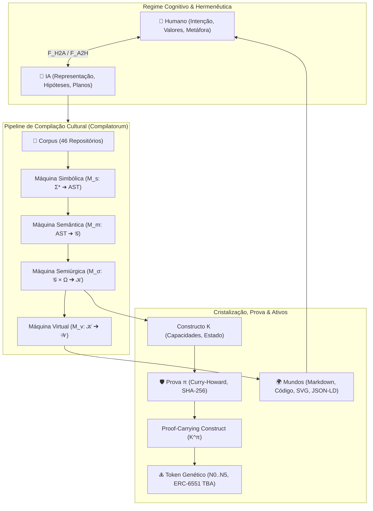

# 🜁 PROTEROL — do Corpus ao Codex

### Language of Transformations • Executable Ontology • Semantic Genome

[](https://github.com/compilatorum/proterol/actions/workflows/ci.yml)
[](LICENSE)
[](https://www.python.org/)
[](https://github.com/compilatorum)

> *"O Proterol não descreve uma realidade previamente dada; ele descreve as transformações pelas quais uma representação pode tornar-se outra."*  
> Portanto, seu objeto primário não é o substantivo. É o **nexo transformacional**:
> $$A \xrightarrow{f} B$$

---

## 🧿 0. A Tese Radical

O Proterol deixa de ser apenas uma linguagem projetada externamente e passa a ser a **linguagem que descreve, compila, prova, interpreta e tokeniza o próprio universo que a originou**.

$$\boxed{\mathcal{C} \longrightarrow \mathcal{A} \longrightarrow \mathcal{G} \longrightarrow \mathcal{P} \longrightarrow \mathcal{F} \longrightarrow \mathcal{K} \longrightarrow \mathcal{R} \longrightarrow \mathcal{N}}$$

- $\mathcal{C}$ = **Corpus** multimodal (chatlogs, código, modelos, specs, equações, glifos);
- $\mathcal{A}$ = **Átomos semânticos** destilados;
- $\mathcal{G}$ = **Genes semânticos** ($g = \langle id, \tau, \sigma, \omega, \pi, \mu, \rho, \kappa, \lambda \rangle$);
- $\mathcal{P}$ = **Programas / Proposições** formais;
- $\mathcal{F}$ = **Functores** (e.g. Funtor Hermenêutico $F_{H2A} \longleftrightarrow F_{A2H}$);
- $\mathcal{K}$ = **Constructos** operacionais semiúrgicos;
- $\mathcal{R}$ = **Renderizações** em mundos multimodais;
- $\mathcal{N}$ = **NFTs / Ativos verificáveis** (genes cristalizados em N0..N5).

$$\boxed{\text{folklore} \longrightarrow \text{formal lore} \longrightarrow \text{executable lore}}$$

---

## 🏛️ 1. O Grande Diagrama Conceitual



---

## 🧠 2. As Quatro Máquinas Sobrepostas

O Proterol decompõe o ato de significação computável em quatro máquinas em cascata:

1. **Máquina Simbólica ($M_s: \Sigma^* \longrightarrow \text{AST}$):**  
   Transforma sequências de signos textuais em Árvore Sintática Abstrata.
2. **Máquina Semântica ($M_m: \text{AST} \longrightarrow \mathcal{G}$):**  
   Transforma a sintaxe em hipergrafo direcionado de relações de significado, resolvendo o contexto $\Gamma$ e tipando termos ($\Gamma \vdash e : \tau$).
3. **Máquina Semiúrgica ($M_\sigma: \mathcal{G} \times \Omega \longrightarrow \mathcal{K}$):**  
   $\text{Sign} \times \text{Operator} \times \text{Context} \to \text{Construct}$. O glifo deixa de ser decoração e torna-se operador ativo.
4. **Máquina Virtual ($M_v: \mathcal{K} \longrightarrow \mathcal{W}$):**  
   Projeta o constructo em mundos perceptíveis: Markdown, diagramas Mermaid, código Python executável, W3C Verifiable Credentials e JSON-LD.

---

## 🧬 3. O Átomo: Semantic Gene

$$g = \langle id, \; \tau, \; \sigma, \; \omega, \; \pi, \; \mu, \; \rho, \; \kappa, \; \lambda \rangle$$

- **$id$:** Identidade canônica invariante;
- **$\tau$:** Tipo formal ($\tau \in \{\text{Entity}, \text{Concept}, \text{Relation}, \text{Process}, \text{State}, \text{Property}, \text{Event}, \text{Agent}, \text{Data}, \text{Rule}, \text{Proof}, \text{Artifact}, \text{Context}, \text{Construct}\}$);
- **$\sigma$:** Signo perceptível / glifo ($\Sigma$);
- **$\omega$:** Repertório de operadores habilitados ($\Omega$);
- **$\pi$:** Proveniência (linhagem de fontes, autores e hash SHA-256);
- **$\mu$:** Significado, definição e intencionalidade semântica;
- **$\rho$:** Regras de renderização sensorial/multimodal;
- **$\kappa$:** Invariantes formais e restrições (*constraints*);
- **$\lambda$:** Licença de execução e recombinação (e.g. MIT, CC-BY-SA-4.0).

---

## 🪙 4. O Ativo Semântico (N0 a N5)

$$\boxed{\text{NFT} \neq \text{JPEG}}$$

$$\boxed{\text{NFT} = \text{Identity} + \text{Metadata} + \text{Semantics} + \text{Provenance} + \text{Interfaces}}$$

| Nível | Tipo | Fórmula | Descrição | Padrão |
|:---:|:---|:---|:---|:---:|
| **N0** | **Atom** | $NFT_0 = g$ | Gene semântico elementar individual | ERC-1155 |
| **N1** | **Motif** | $NFT_1 = g_1 \oplus g_2$ | Recombinação de genes afins | ERC-1155 |
| **N2** | **Skill** | $NFT_2 = \{g_1, \dots, g_n\} + \Omega$ | Capacidade agêntica operacional | ERC-721/1155 |
| **N3** | **Agent** | $NFT_3 = \text{Genome} + \text{Runtime}$ | Agente autônomo com memória e política | ERC-6551 (TBA) |
| **N4** | **Construct** | $NFT_4 = \text{Agent} + \text{Data} + \text{Workflow}$ | Constructo semiúrgico autocontido | ERC-6551 (TBA) |
| **N5** | **Ecosystem** | $NFT_5 = \sum K_i + \text{Relations} + \text{Treasury}$ | Organismo ecológico descentralizado | Protocolo DAO |

---

## 🌳 5. Compilatorum como Organismo Formal

Os repositórios do ecossistema Compilatorum deixam de ser ilhas isoladas de código e passam a ser **órgãos e genes de um mesmo programa semântico**:

| Repositório | Glifo | Papel no Proterol | Tipo ($\tau$) | Operadores ($\Omega$) |
|:---|:---:|:---|:---|:---|
| [`corpora`](https://github.com/compilatorum) | 🧫 | Corpus multimodal e sedimentação cultural | `Data` | `query, split, anchor` |
| [`promptcraft`](https://github.com/compilatorum/promptcraft) | 🧪 | Destilador e refinamento de intenções | `Process` | `infer, measure, amplify` |
| [`glyphtionary`](https://github.com/compilatorum/glyphtionary) | 🔣 | Léxico, álgebra de signos e genoma semântico | `Concept` | `map, transmute, resonate` |
| [`compilatum`](https://github.com/compilatorum/compilatum) | 🧠 | Monorepo-síntese e Meta-IR arqueológica | `Construct` | `compile, join, prove` |
| `cognitiv` | 🪞 | Metacognição e auto-reflexão recursiva | `Process` | `reflect, test, change` |
| `SLM` | 🧬 | Modelo cognitivo leve e especializado | `Agent` | `infer, learn, simulate` |
| `NaturalLanguageCognitiveArchitecture` | 🧠 | Arquitetura cognitiva em linguagem natural | `Process` | `map, infer, plan` |
| `emacs` | ✍️ | Transcrição dinâmica linguagem $\leftrightarrow$ código | `Artifact` | `compile, link, render` |
| [`lakehouse`](https://github.com/compilatorum) | 💾 | Memória multimodal persistente | `Data` | `anchor, query, have` |
| `knowledge-weaver` | 🕸️ | Tecer de grafos de conhecimento | `Relation` | `link, join, resonate` |
| [`oracle`](https://github.com/compilatorum/oracle) | 🔮 | Agrofloresta computacional e curadoria | `Process` | `simulate, measure, transmute` |
| [`omni-laboratory`](https://github.com/compilatorum/omni-laboratory) | 🎞️ | Semiurgia, scene graph e renderização agêntica | `Construct` | `render, make, amplify, dissolve` |
| `neurocoder` | 🤖 | Inteligência de código e autocompilação | `Agent` | `compile, test, infer` |
| `cadcad-explorer` | 🧮 | Simulação de dinâmicas de sistemas complexos | `Process` | `simulate, measure, test` |
| `neurosimbolic-trader` | 📈 | Decisão simbólico-quantitativa e mercado | `Agent` | `infer, measure, change` |
| [`DAO`](https://github.com/compilatorum/DAO) | 🏛️ | Governança descentralizada e tesouraria | `Entity` | `link, join, have` |
| [`value-curator`](https://github.com/compilatorum/value-curator) | 🛡️ | Execução por evidências e recibos determinísticos | `Proof` | `prove, test, tokenize` |
| `regenerativo` | 🌱 | Semântica ecológica e fluxos regenerativos | `Concept` | `resonate, measure, anchor` |
| `web3-launchpad` | 🚀 | Distribuição e liquidez de tokens | `Process` | `tokenize, make, link` |
| `harness-engineering` | 🧰 | Ambiente de execução e harness de agentes | `Artifact` | `test, simulate, compile` |

---

## 📚 6. O Proterol Codex (Os 12 Livros)

Toda a teoria formal está documentada e versionada no diretório [`codex/`](codex/):

1. [**Livro I — Fundamento**](codex/Book_01_Fundamento.md): A interlíngua semiótica $P : L_i \longleftrightarrow L_j$ e o nexo $A \xrightarrow{f} B$.
2. [**Livro II — Ontologia**](codex/Book_02_Ontologia.md): Os 14 tipos fundamentais e tipagem dependente.
3. [**Livro III — Semiótica**](codex/Book_03_Semiotica.md): A quádrupla $\langle \sigma, \mu, \text{referent}, \Gamma \rangle$ e as 7 modalidades.
4. [**Livro IV — Sintaxe**](codex/Book_04_Sintaxe.md): Gramática de nexos e composição categorial ($g \circ f$).
5. [**Livro V — Operadores**](codex/Book_05_Operadores.md): A família $\Omega$ (ontológicos, relacionais, epistêmicos, computacionais e semiúrgicos).
6. [**Livro VI — Semântica**](codex/Book_06_Semantica.md): A interpretação contextual $\llbracket e \rrbracket_\Gamma$ e as distinções de níveis.
7. [**Livro VII — Tipos e Provas**](codex/Book_07_Tipos_e_Provas.md): Isomorfismo de Curry–Howard e semântica baseada em provas ($\pi : P$).
8. [**Livro VIII — Hermenêutica**](codex/Book_08_Hermeneutica.md): Funtor Hermenêutico $\mathcal{H}$ e os morfismos cognitivos $F_{H2A} \longleftrightarrow F_{A2H}$.
9. [**Livro IX — Semiurgia**](codex/Book_09_Semiurgia.md): Transformação de signos em efeitos ($\mathfrak{S}$) e o glifo como operador.
10. [**Livro X — Transdução**](codex/Book_10_Transducao.md): Transdutor universal com tracking do delta de perda ($T(x) = y + \Delta$).
11. [**Livro XI — Tokenização**](codex/Book_11_Tokenizacao.md): Cristalização de estados em ativos verificáveis (N0..N5 e ERC-6551).
12. [**Livro XII — Reflexividade**](codex/Book_12_Reflexividade.md): Autofundamentação ($P \vdash P : \text{Language}$) e autocompilação.

Consulte também: [**Axiomas, Metacrítica e Síntese Máxima**](codex/Axiomas_e_Sintese.md).

---

## ⚡ 7. Instalação e Uso Rápido (CLI)

### Instalação Local
```bash
git clone https://github.com/compilatorum/proterol.git
cd proterol
pip install -e .
```

### Comandos da CLI
```bash
# 1. Analisar sintaticamente um script Proterol (.pro)
proterol parse examples/compilatorum_self.pro

# 2. Executar o pipeline de compilação de 10 estágios
proterol compile examples/compilatorum_self.pro --construct-id OrganismoCompilatorum

# 3. Renderizar constructo em modalidades visuais (Markdown, Mermaid, JSON-LD, Código)
proterol render examples/compilatorum_self.pro --format mermaid
proterol render examples/compilatorum_self.pro --format code

# 4. Verificar recibos criptográficos e integridade de prova (K^π)
proterol prove examples/compilatorum_self.pro

# 5. Mapear os 46 repositórios do ecossistema formal Compilatorum
proterol organism

# 6. Consultar os Livros do Codex
proterol codex 1
```

---

## 🛡️ 8. Metacrítica Inviolável

1. **Nem tudo é NFT:** $\text{Tokenize}(x) \iff \text{Identity} \land \text{Utility} \land \text{Provenance} \land \text{CirculationRationale}$.
2. **Incerteza semântica:** $\text{Unknown} \neq \text{False}$ e $\text{Ambiguous} \neq \text{Invalid}$.
3. **Estratificação da verdade:** $\text{WellFormed} \neq \text{Valid} \neq \text{True} \neq \text{Useful} \neq \text{Valuable}$.

---

## 📜 Licença

Distribuído sob a licença [MIT](LICENSE). Desenvolvido por [João Nitsche (Sukata)](https://github.com/compilatorum) como parte do ecossistema Compilatorum. 🜂🧬
